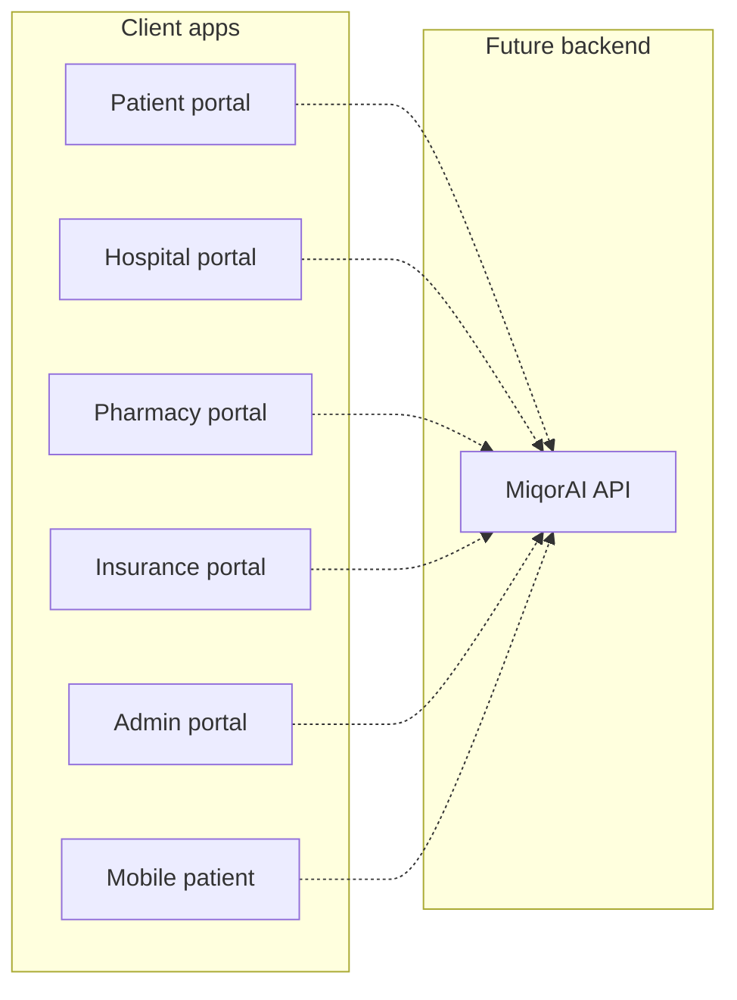

# MiqorAI

MiqorAI is a connected health network platform with separate web and mobile applications for patients, hospitals, pharmacies, insurers, and platform administrators. Each app is an independent frontend with its own dependencies, dev server port, and Docker image.

## Repository structure

| Directory | Role | Stack | Dev port |
|-----------|------|-------|----------|
| `patient-portal-desktop/` | Patient web portal (records, QR, export) | Vite, React, React Router | 5173 |
| `hospital-portal/` | Hospital staff workspace | Vite, React, shadcn/ui | 8080 |
| `insurance-portal/` | Insurer analytics and operations | Vite, React, shadcn/ui | 8081 |
| `pharmacy-portal/` | Pharmacy dispensing workspace | Vite, React, shadcn/ui | 8082 |
| `admin-portal/` | Platform management cockpit | TanStack Start, React | 8083 |
| `mobile_patient/` | Patient mobile app | Expo, React Native | Expo default |

Supporting folders:

- `scripts/` — helper scripts to run all web frontends at once
- `docker/` — shared Docker assets
- `docker-compose.yml` — orchestrates all web portal containers

## What was changed in this cleanup

1. **Removed Lovable tooling** — deleted `.lovable/` folders, `bun.lock` files, `lovable-tagger`, and `@lovable.dev/vite-tanstack-config`. Vite configs now use standard plugins only.
2. **Rebranded to MiqorAI** — replaced MediPass, Med-Pass, and related naming across user-facing text, storage keys, demo credentials, and component paths (`components/MiqorAI/`).
3. **Assigned unique dev ports** — each web portal runs on its own port so they can run simultaneously without conflict.
4. **Added run-all scripts** — start every web frontend with one command.
5. **Added Docker support** — multi-stage Dockerfiles per portal plus `docker-compose.yml` for production-style deployment.

## Prerequisites

- **Node.js 22+** and **npm**
- For mobile: **Expo CLI** (via `npx expo`)

## Quick start — run all web frontends

From the repository root:

```powershell
# Windows
.\scripts\run-all-frontends.ps1
```

```bash
# macOS / Linux
chmod +x scripts/run-all-frontends.sh
./scripts/run-all-frontends.sh
```

Or using npm directly:

```bash
npm install
npm run dev
```

Then open:

- Patient: http://localhost:5173
- Hospital: http://localhost:8080
- Insurance: http://localhost:8081
- Pharmacy: http://localhost:8082
- Admin: http://localhost:8083

## Run a single frontend

```bash
cd patient-portal-desktop   # or any portal folder
npm install
npm run dev
```

## Build all web frontends

```bash
npm install
npm run install:all
npm run build:all
```

## Demo credentials

Most staff portals accept any valid staff email with demo password:

```
MiqorAI
```

(Previously documented as `medpass`; updated during rebranding.)

## Docker deployment

Each portal includes its own `Dockerfile`. SPA portals (patient, hospital, insurance, pharmacy) are built with Node and served by nginx. The admin portal uses a Node runtime for TanStack Start SSR output.

Build and run everything:

```bash
docker compose build
docker compose up
```

Individual image:

```bash
cd hospital-portal
docker build -t MiqorAI-hospital-portal .
docker run -p 8080:80 MiqorAI-hospital-portal
```

Port mapping when using `docker compose up`:

| Service | Host port |
|---------|-----------|
| patient-portal | 5173 |
| hospital-portal | 8080 |
| insurance-portal | 8081 |
| pharmacy-portal | 8082 |
| admin-portal | 8083 |

## Mobile patient app

```bash
cd mobile_patient
npm install
npm start
```

See `mobile_patient/README.md` for Expo setup details.

## Architecture overview



Currently each frontend uses local mock data and does not require a shared backend to run in development.

## Per-app documentation

- `patient-portal-desktop/` — patient web UI
- `hospital-portal/README.md`
- `insurance-portal/README.md`
- `pharmacy-portal/README.md`
- `mobile_patient/README.md`

## Verification checklist

Run these commands from the repo root to confirm the cleanup:

```powershell
# 1. No Lovable references in source (lockfiles may still mention removed packages until npm install)
Select-String -Path .\*\src\* -Pattern "lovable|Lovable" -Recurse

# 2. No old MediPass branding in source
Select-String -Path .\*\src\* -Pattern "MediPass|Med-Pass|medpass" -Recurse

# 3. Install and build all web apps
npm install
npm run install:all
npm run build:all

# 4. Start all dev servers (Ctrl+C to stop)
npm run dev

# 5. Docker (when your machine can handle it)
docker compose config
docker compose build
```

On bash:

```bash
rg -i "lovable" --glob '!node_modules' --glob '!package-lock.json'
rg -i "medipass|med-pass|medpass" --glob '!node_modules' --glob '!package-lock.json'
npm install && npm run install:all && npm run build:all
```

## License

Proprietary — MiqorAI.
